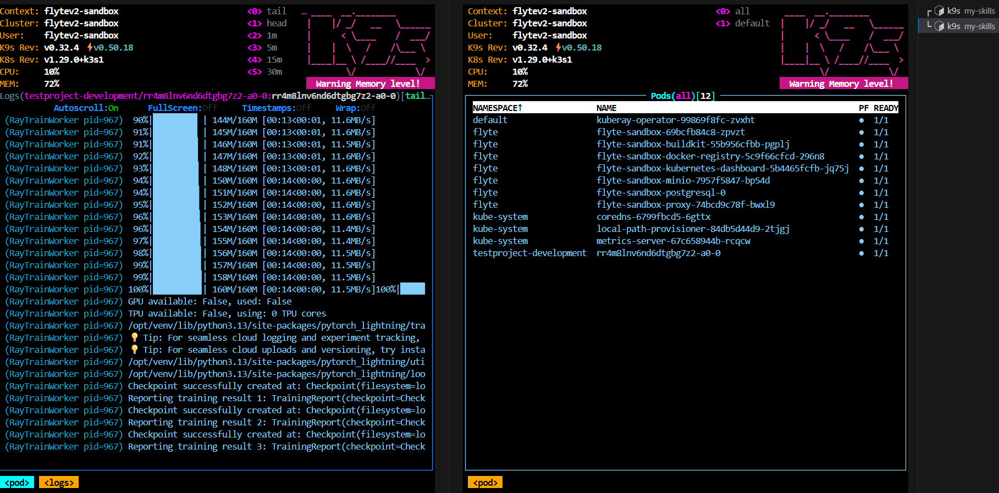

# How to run?

```sh
uv sync --lock
source .venv/bin/activate
uv run main.py
```

# Result




---

# Attach Skills to Claude

`attach_claude_skill.sh` copies skill definitions from `skills/` into `.claude/skills/` so Claude Code can discover and invoke them.

## Usage

**Attach all skills:**
```sh
./attach_claude_skill.sh
```

**Attach a specific skill:**
```sh
./attach_claude_skill.sh <skill_name>
```

## Examples

```sh
# Attach all skills at once
./attach_claude_skill.sh

# Attach only the bbc_news skill
./attach_claude_skill.sh bbc_news

# Attach only the md_to_letex skill
./attach_claude_skill.sh md_to_letex
```

## How it works

The script copies `skills/<skill_name>/SKILL.md` → `.claude/skills/<skill_name>/SKILL.md`.

Once copied, Claude Code reads the SKILL.md files and can invoke the corresponding Flyte tasks via `flyte run --local`.

## Available Skills

| Skill | Description |
|-------|-------------|
| `bbc_news` | Fetch latest BBC News headlines |
| `html_to_ppt` | Convert an HTML page to a PowerPoint presentation |
| `letex_to_pdf` | Compile a LaTeX `.tex` file to PDF |
| `md_to_letex` | Convert a Markdown `.md` file to LaTeX `.tex` |
| `roboflow_ray_train` | Download a Roboflow COCO dataset and train a Faster RCNN object detection model using Flyte + Ray Train + PyTorch Lightning on CPU |

---

# roboflow_ray_train

下載 Roboflow COCO 資料集，使用 **Flyte + Ray Train + PyTorch Lightning（CPU）** 訓練 Faster RCNN 物件偵測模型，評估 mAP@0.5，若達到精確度要求則儲存 `model.pt`。

## 使用時機

- 想在 Roboflow 資料集上訓練物件偵測模型
- 使用 Flyte + Ray Train 進行分散式 CPU 訓練
- 自動完成訓練與精確度驗證

## 參數

| 參數 | 類型 | 必填 | 說明 |
|------|------|------|------|
| `--roboflow_url` | `str` | 是 | Roboflow COCO 資料集 zip 的下載 URL，或本地已解壓的資料集目錄路徑 |
| `--accuracy_request` | `float` | 是 | 最低 mAP@0.5 門檻（例如 `0.5` 代表 50%），達到才儲存模型 |
| `--output` | `str` | 否 | model.pt 輸出路徑（預設：`model.pt`） |

## 執行方式

```sh
flyte run --local skill_impl/roboflow_ray_train/roboflow_ray_train.py roboflow_ray_train \
    --roboflow_url <url_or_path> \
    --accuracy_request <float> \
    --output model.pt
```

## 運作流程

1. 從 `roboflow_url` 下載資料集 zip（或使用本地路徑）
2. 自動偵測標準 Roboflow COCO 目錄結構中的 `train` / `valid` / `val` 標註檔案
3. 以 `TorchTrainer` + `RayDDPStrategy` 啟動 Ray Train（2 個 CPU worker）
4. 使用 Faster RCNN（ResNet-50 FPN backbone，ImageNet 預訓練）訓練 10 個 epoch
5. 在驗證集上評估 mAP@0.5（無驗證集時回退至訓練集）
6. 若 `mAP@0.5 >= accuracy_request`，儲存 `model.pt` 並回傳路徑；否則回傳 `None`

## 範例

**使用遠端 Roboflow URL：**
```sh
flyte run --local skill_impl/roboflow_ray_train/roboflow_ray_train.py roboflow_ray_train \
    --roboflow_url "https://app.roboflow.com/ds/XXXXXXXX" \
    --accuracy_request 0.5
```

**使用本地資料集：**
```sh
flyte run --local skill_impl/roboflow_ray_train/roboflow_ray_train.py roboflow_ray_train \
    --roboflow_url "/data/my_dataset" \
    --accuracy_request 0.6 \
    --output model.pt
```

## 注意事項

- 僅使用 CPU 訓練（不需要 GPU）
- 預設使用 2 個 Ray worker（`ScalingConfig(num_workers=2, use_gpu=False)`）
- 精確度指標為 **mAP@0.5**（IoU 閾值 0.5 的平均精確度）
- 在 Kubernetes + Flyte 環境中，`RayJobConfig` 會自動建立並在執行後銷毀 KubeRay cluster
- 分散式多機執行時，所有 worker 需共享資料集目錄（NFS、EFS 等），單機本地執行則無此限制