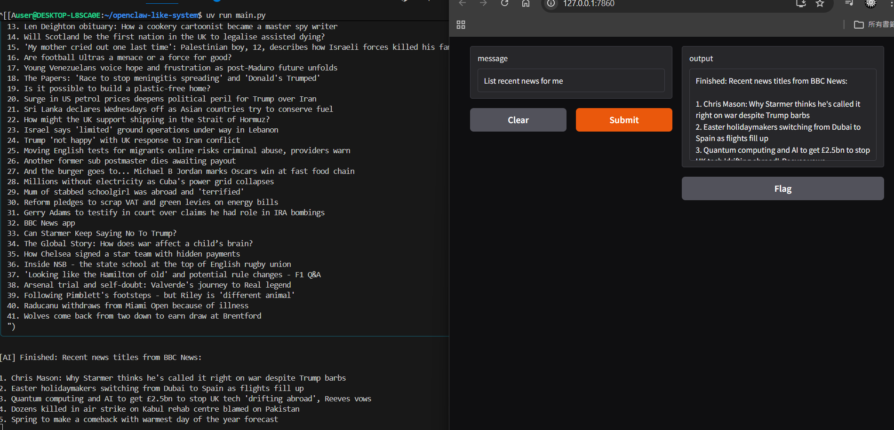

# How to run?

```sh
uv sync --lock
source .venv/bin/activate
uv run main.py
```

# Result


---

# Attach Skills to Claude

`attach_claude_skill.sh` copies skill definitions from `skills/` into `.claude/skills/` so Claude Code can discover and invoke them.

## Usage

**Attach all skills:**
```sh
./attach_claude_skill.sh
```

**Attach a specific skill:**
```sh
./attach_claude_skill.sh <skill_name>
```

## Examples

```sh
# Attach all skills at once
./attach_claude_skill.sh

# Attach only the bbc_news skill
./attach_claude_skill.sh bbc_news

# Attach only the md_to_letex skill
./attach_claude_skill.sh md_to_letex
```

## How it works

The script copies `skills/<skill_name>/SKILL.md` → `.claude/skills/<skill_name>/SKILL.md`.

Once copied, Claude Code reads the SKILL.md files and can invoke the corresponding Flyte tasks via `flyte run --local`.

## Available Skills

| Skill | Description |
|-------|-------------|
| `bbc_news` | Fetch latest BBC News headlines |
| `html_to_ppt` | Convert an HTML page to a PowerPoint presentation |
| `letex_to_pdf` | Compile a LaTeX `.tex` file to PDF |
| `md_to_letex` | Convert a Markdown `.md` file to LaTeX `.tex` |